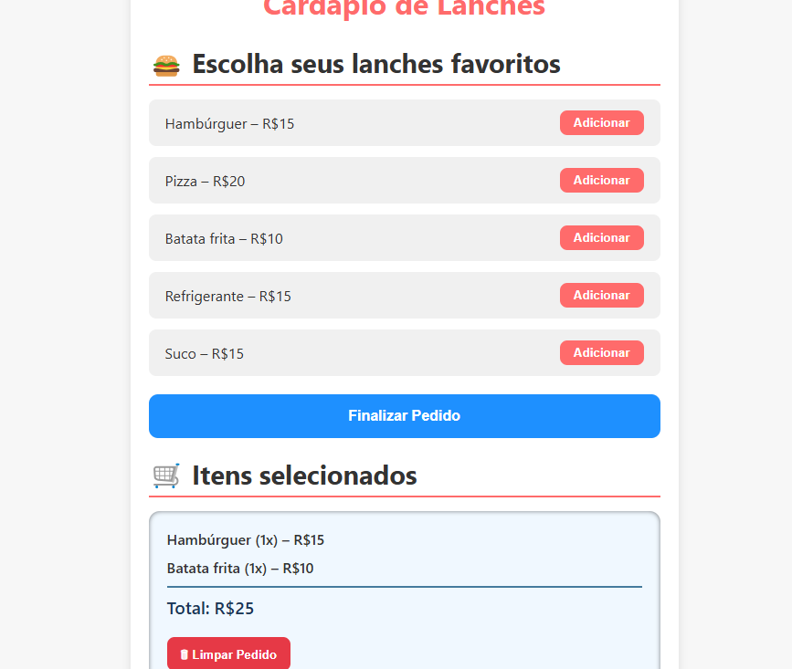

# 🍔 Cardápio Interativo com Carrinho

Este é um projeto simples desenvolvido em **JavaScript**, **HTML** e **CSS**, que simula um **cardápio online interativo**.  
O usuário pode **adicionar lanches ao carrinho**, **visualizar o resumo do pedido** e **calcular o total automaticamente**.

---

## 🚀 Funcionalidades

- 📋 Listagem de lanches com nome e preço  
- ➕ Botão **"Adicionar"** para incluir no carrinho  
- 🔢 Exibe **quantidade e subtotal** de cada item  
- 💰 Calcula o **total do pedido** automaticamente  
- 🧹 Botão **"Limpar Pedido"** para resetar o carrinho  
- 🎨 Layout estilizado com CSS moderno  

---

## 🛠️ Tecnologias Utilizadas

- **HTML5**
- **CSS3**
- **JavaScript (manipulação do DOM e eventos)**

---

## 📸 Preview




## 🔮 Próximas Melhorias

- **Adicionar campo para nome do cliente**
- **Criar opção de remover itens individualmente**
- **Implementar métodos de pagamento**


## 👨‍💻 Autor

Feito por Jeffinsr 😊


## ▶️ Como Rodar o Projeto

1. Clone este repositório:
   ```bash
   git clone https://github.com/Jeffinsr/cardapio-interativo.git
